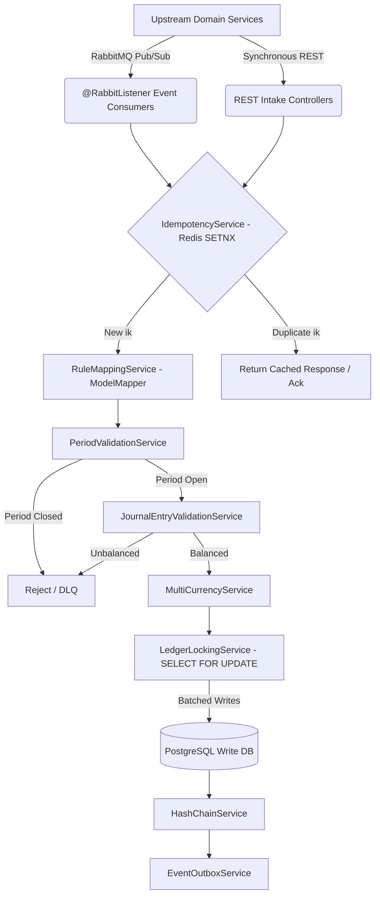

# Technical Architecture Document: Generic FIS Engine (Java 25 / Spring Boot 4.0)

## 1. System Context & Overview

The Generic Financial Information System (FIS) acts as the immutable system of record for the organization. It sits below operational domain services (e.g., E-commerce, Payroll, Loans) and abstracts their transactional chaos into orderly financial ledgers.

**Primary architectural goals:**
- Decoupled ingestion of events via **RabbitMQ** (Quorum Queues).
- Distributed idempotency and caching utilizing **Redis**.
- Strictly ACID-compliant persistence for Ledgers via PostgreSQL.
- Extreme concurrency relying fundamentally on **Java 25 Virtual Threads** and PostgreSQL pessimistic locking.
- Type-safe, `NullPointerException`-free domain code leveraging **Spring Boot 4.0.1** and **JSpecify**.

## 2. High-Level Architecture Diagram



## 3. Technology Stack (2026 Native)

### 3.1 Java 25 Enhancements
- **Virtual Threads:** Enabled by default in Spring Boot 4 for Tomcat/Jetty. All database I/O is non-blocking on the OS level.
- **Compact Object Headers (JEP 519):** Lowers object overhead by up to 33%, reducing memory pressure for massive Virtual Thread concurrency.
- **Scoped Values (JEP 506):** Replaces `ThreadLocal` for propagating Tenant IDs and Trace Spans across Virtual Threads.
- **Flexible Constructor Bodies (JEP 513):** Enables validation logic before `super()` calls in entity constructors.

### 3.2 Spring Boot 4.0.1 Modularity & Observability
- **Modularity:** Narrowed starters (`spring-boot-starter-webmvc`, `spring-boot-starter-amqp`, `spring-boot-starter-data-jpa`).
- **OpenTelemetry:** Native `spring-boot-starter-opentelemetry` for metrics, traces, and SLF4J structured logs with W3C Traceparent propagation across RabbitMQ.
- **Outbound HTTP:** `@HttpExchange` declarative interfaces for external service calls.
- **Null Safety:** `@NullMarked` on `package-info.java` in every package.
- **API Versioning:** Native support via URI path segments (`/v1/`, `/v2/`).
- **Error Handling:** `ResponseEntityExceptionHandler` + `@ControllerAdvice` returning RFC 7807 `ProblemDetail` responses.

### 3.3 Messaging (RabbitMQ)
- **Quorum Queues:** RAFT consensus, durable, replicated across broker nodes.
- **Dead Letter Exchange (DLX):** Routes unprocessable messages to `fis.ingestion.dlq.queue`.
- **Manual Acknowledgment:** `channel.basicAck()` only after successful Postgres commit.

### 3.4 Idempotency (Redis)
- **Canonical `ik`:** `eventId` from payload/request.
- **Key Pattern:** `fis:ik:{tenant_id}:{event_id}`
- **Command:** `SET fis:ik:{tenantId}:evt_123 "{status:PROCESSING}" NX EX 259200` (72-hour TTL)
- **Eviction Policy:** `volatile-ttl` — evicts keys closest to natural expiration first.
- **On duplicate:** Return cached response, immediately `basicAck()`.

### 3.5 Hot Account Locking Strategy
- Uses PostgreSQL `SELECT ... FOR UPDATE` to acquire row-level locks on target Account balance rows.
- Retries with bounded backoff are applied on lock timeout to preserve correctness under contention.
- Accounts are locked in deterministic order (`ORDER BY account_id`) to reduce deadlock probability.
- Hot-account scalability guardrail: support horizontal partitioning of high-traffic ledger flows by shard account strategy while preserving accounting invariants.
- Balance update: `UPDATE fis_account SET current_balance = current_balance + :delta WHERE account_id = :id`.

## 4. Internal Service Processing Pipeline

Each incoming financial event passes through a strict, ordered chain of stateless services:

| Order | Service | Responsibility |
|-------|---------|----------------|
| 1 | `EventIntakeService` | Receives REST payload or RabbitMQ message. Extracts headers. |
| 2 | `IdempotencyService` | Redis `SETNX`. Rejects duplicates. |
| 3 | `RuleMappingService` | Loads mapping rule by `eventType`. Uses ModelMapper to produce `DraftJournalEntry`. |
| 4 | `PeriodValidationService` | Checks if the target `postedDate` falls within an `OPEN` Accounting Period. |
| 5 | `JournalEntryValidationService` | Validates `Sum(Debits) == Sum(Credits)`. Validates account codes exist and are active. |
| 6 | `MultiCurrencyService` | If `transactionCurrency != baseCurrency`, applies exchange rate from `fis_exchange_rate` table. Computes base-currency amounts. |
| 7 | `LedgerLockingService` | Acquires `SELECT ... FOR UPDATE` on account rows. |
| 8 | `LedgerPersistenceService` | ACID transaction: inserts `journal_entry` + `journal_lines`, updates `account.current_balance`. |
| 9 | `HashChainService` | Computes SHA-256 hash of `(journal_entry_id + previous_hash + created_at)` and stores it. |
| 10 | `EventOutboxService` | Publishes a domain event (e.g., `journal.entry.posted`) for downstream consumers via Transactional Outbox. |

## 5. Schema Evolution Strategy (Flyway)

- **Location:** `src/main/resources/db/migration/`
- **Naming Convention:** `V{version}__{description}.sql` (e.g., `V1__create_business_entity.sql`, `V2__create_accounts.sql`)
- **Hibernate DDL-auto:** `validate` in production, `none` in CI/CD.
- **Testing:** All migrations validated via Testcontainers with PostgreSQL images before merging.
- **Rules:** Migration files are immutable once deployed. Schema and data migrations are in separate files.
- **Rollback Plan:** Manual rollback scripts are maintained alongside forward migrations for critical tables.

## 6. Global Error Handling (RFC 7807)

All REST endpoints return errors as RFC 7807 `ProblemDetail` objects via a `@ControllerAdvice` global exception handler.

**Standard Error Types:**
| HTTP Status | Type URI | Title |
|-------------|----------|-------|
| 400 | `/problems/validation-failed` | Validation Failed |
| 404 | `/problems/account-not-found` | Account Not Found |
| 409 | `/problems/duplicate-idempotency-key` | Duplicate Idempotency Key |
| 409 | `/problems/invalid-reversal` | Invalid Reversal |
| 422 | `/problems/unbalanced-entry` | Unbalanced Journal Entry |
| 422 | `/problems/period-closed` | Accounting Period Closed |
| 500 | `/problems/internal-error` | Internal Server Error |

**Example Response:**
```json
{
  "type": "/problems/unbalanced-entry",
  "title": "Unbalanced Journal Entry",
  "status": 422,
  "detail": "Journal Entry is unbalanced. Total Debits: 5000, Total Credits: 4000.",
  "instance": "/v1/journal-entries"
}
```

## 7. Security Architecture
- **RBAC Roles:** `ROLE_FIS_ADMIN` (full access), `ROLE_FIS_ACCOUNTANT` (post entries, view), `ROLE_FIS_READER` (read-only).
- **TLS 1.3:** All inter-service communication encrypted.
- **VPC Isolation:** API Gateway, RabbitMQ, Redis, and PostgreSQL within a secure private network.
- **Audit Trail:** All mapping rule changes and manual journal entries logged with `created_by`, `created_at`, and client IP.
