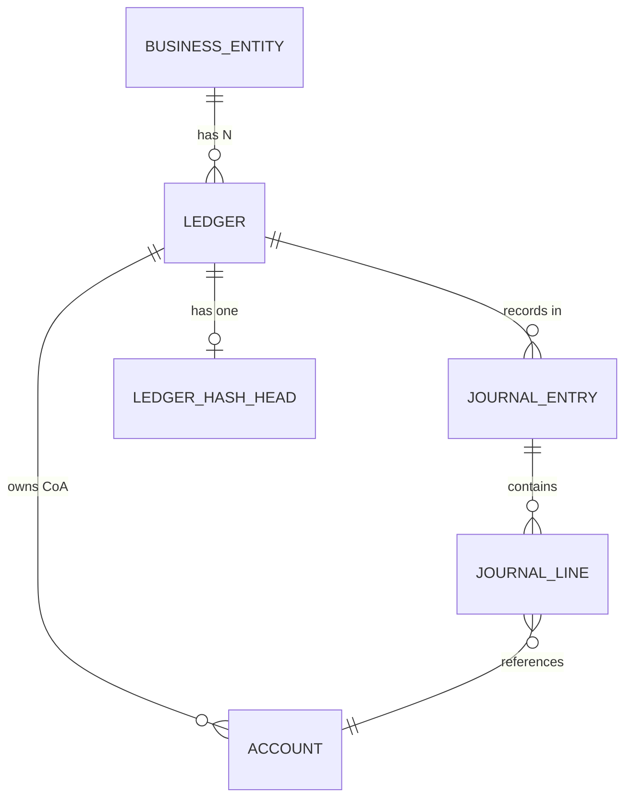

# Multi-Ledger (N Charts of Accounts) Implementation Plan

## Phase 8 — Ledger Dimension

---

| Field | Value |
| :---- | :---- |
| **Document Title** | Multi-Ledger Implementation Plan |
| **Version** | 1.0 |
| **Date** | February 26, 2026 |
| **Priority** | P1 — Feature Enhancement |
| **Estimated Effort** | 5–6 working days |
| **Prerequisite** | All R1–R8 remediation phases complete |

---

## 1. Problem Statement

The current FIS Engine supports **one Chart of Accounts (CoA) per tenant**. Some organizations require **multiple parallel CoAs** for the same business entity — e.g., Local GAAP, IFRS, and Management Reporting — each with different account codes, structures, and recognition rules.

---

## 2. Design Overview

Introduce a **Ledger** entity as a child of `BusinessEntity` (tenant). Each Ledger owns its own Chart of Accounts, Journal Entries, and hash chain. All existing behavior is preserved via a **default ledger** mechanism.

### Entity Relationship (After)



### Key Design Decisions

| Decision | Rationale |
|---|---|
| Default ledger auto-created per tenant | **Backward compatibility** — existing API calls without `X-Ledger-Id` use the default ledger |
| `X-Ledger-Id` header is **optional** | If omitted, the default ledger is used. Zero breaking changes for existing integrations |
| Accounting periods are **shared across ledgers** | Fiscal calendar is an organizational concern, not a CoA concern |
| Exchange rates are **shared across ledgers** | FX rates are factual data, not ledger-specific |
| Mapping rules are **per ledger** | Different CoAs need different event-to-JE mappings |
| Hash chain is **per ledger** | Each ledger has independent tamper-detection |

---

## 3. Detailed Changes

### 3.1 Database Layer

#### [NEW] Flyway migration `V12__create_ledger.sql`

```sql
-- Ledger table
CREATE TABLE fis_ledger (
    ledger_id   UUID PRIMARY KEY,
    tenant_id   UUID NOT NULL REFERENCES fis_business_entity(tenant_id),
    code        VARCHAR(50) NOT NULL,
    name        VARCHAR(255) NOT NULL,
    description TEXT,
    is_default  BOOLEAN NOT NULL DEFAULT FALSE,
    is_active   BOOLEAN NOT NULL DEFAULT TRUE,
    created_at  TIMESTAMP WITH TIME ZONE NOT NULL,
    updated_at  TIMESTAMP WITH TIME ZONE NOT NULL,
    UNIQUE (tenant_id, code)
);

-- Ensure exactly one default ledger per tenant
CREATE UNIQUE INDEX uq_ledger_default_per_tenant
    ON fis_ledger(tenant_id) WHERE is_default = TRUE;

CREATE INDEX idx_ledger_tenant ON fis_ledger(tenant_id, is_active);
```

#### [NEW] Flyway migration `V13__add_ledger_id_to_account_and_journal.sql`

```sql
-- 1. Add ledger_id to fis_account
ALTER TABLE fis_account ADD COLUMN ledger_id UUID;

-- 2. Add ledger_id to fis_journal_entry
ALTER TABLE fis_journal_entry ADD COLUMN ledger_id UUID;

-- 3. Add ledger_id to fis_mapping_rule
ALTER TABLE fis_mapping_rule ADD COLUMN ledger_id UUID;

-- 4. Create default ledger for every existing tenant
INSERT INTO fis_ledger (ledger_id, tenant_id, code, name, is_default, is_active, created_at, updated_at)
SELECT
    gen_random_uuid(),
    tenant_id,
    'DEFAULT',
    name || ' - Default Ledger',
    TRUE,
    TRUE,
    NOW(),
    NOW()
FROM fis_business_entity;

-- 5. Backfill: assign all existing accounts to their tenant's default ledger
UPDATE fis_account a
SET ledger_id = l.ledger_id
FROM fis_ledger l
WHERE a.tenant_id = l.tenant_id AND l.is_default = TRUE;

-- 6. Backfill: assign all existing journal entries to their tenant's default ledger
UPDATE fis_journal_entry je
SET ledger_id = l.ledger_id
FROM fis_ledger l
WHERE je.tenant_id = l.tenant_id AND l.is_default = TRUE;

-- 7. Backfill: assign all existing mapping rules to their tenant's default ledger
UPDATE fis_mapping_rule mr
SET ledger_id = l.ledger_id
FROM fis_ledger l
WHERE mr.tenant_id = l.tenant_id AND l.is_default = TRUE;

-- 8. Make ledger_id NOT NULL after backfill
ALTER TABLE fis_account ALTER COLUMN ledger_id SET NOT NULL;
ALTER TABLE fis_journal_entry ALTER COLUMN ledger_id SET NOT NULL;
ALTER TABLE fis_mapping_rule ALTER COLUMN ledger_id SET NOT NULL;

-- 9. Add foreign keys
ALTER TABLE fis_account ADD CONSTRAINT fk_account_ledger
    FOREIGN KEY (ledger_id) REFERENCES fis_ledger(ledger_id);
ALTER TABLE fis_journal_entry ADD CONSTRAINT fk_je_ledger
    FOREIGN KEY (ledger_id) REFERENCES fis_ledger(ledger_id);
ALTER TABLE fis_mapping_rule ADD CONSTRAINT fk_mapping_rule_ledger
    FOREIGN KEY (ledger_id) REFERENCES fis_ledger(ledger_id);

-- 10. Update unique constraints
ALTER TABLE fis_account DROP CONSTRAINT IF EXISTS fis_account_tenant_id_code_key;
ALTER TABLE fis_account ADD CONSTRAINT uq_account_ledger_code UNIQUE (tenant_id, ledger_id, code);

ALTER TABLE fis_mapping_rule DROP CONSTRAINT IF EXISTS fis_mapping_rule_tenant_id_event_type_key;
ALTER TABLE fis_mapping_rule ADD CONSTRAINT uq_mapping_rule_ledger_event
    UNIQUE (tenant_id, ledger_id, event_type);

-- 11. New indexes
CREATE INDEX idx_account_ledger ON fis_account(ledger_id);
CREATE INDEX idx_je_ledger ON fis_journal_entry(ledger_id);
CREATE INDEX idx_mapping_rule_ledger ON fis_mapping_rule(ledger_id);
```

> [!IMPORTANT]
> The `UPDATE` statements in step 5–7 will temporarily violate the append-only trigger on `fis_journal_entry`. The migration must temporarily disable the trigger:
> ```sql
> ALTER TABLE fis_journal_entry DISABLE TRIGGER fis_reject_je_update;
> -- ... run UPDATE ...
> ALTER TABLE fis_journal_entry ENABLE TRIGGER fis_reject_je_update;
> ```

---

### 3.2 Entity Layer

#### [NEW] `Ledger.java`

```
src/main/java/com/bracit/fisprocess/domain/entity/Ledger.java
```

| Field | Type | Description |
|---|---|---|
| `ledgerId` | `UUID` | Primary key |
| `tenantId` | `UUID` | FK to `fis_business_entity` |
| `code` | `String` | Unique per tenant (e.g., `LOCAL_GAAP`, `IFRS`, `MGMT`) |
| `name` | `String` | Human-readable name |
| `description` | `String` | Optional |
| `isDefault` | `boolean` | One default per tenant |
| `isActive` | `boolean` | Deactivation support |
| `createdAt` | `OffsetDateTime` | |
| `updatedAt` | `OffsetDateTime` | |

#### [MODIFY] `Account.java`

- Add `ledgerId UUID` field with `@Column(name = "ledger_id", nullable = false)`
- Add `@ManyToOne(fetch = FetchType.LAZY) Ledger ledger` (optional — for navigation)

#### [MODIFY] `JournalEntry.java`

- Add `ledgerId UUID` field with `@Column(name = "ledger_id", nullable = false)`

#### [MODIFY] `MappingRule.java`

- Add `ledgerId UUID` field with `@Column(name = "ledger_id", nullable = false)`

#### [MODIFY] `DraftJournalEntry.java`

- Add `ledgerId UUID` field

---

### 3.3 Repository Layer

#### [NEW] `LedgerRepository.java`

```java
public interface LedgerRepository extends JpaRepository<Ledger, UUID> {
    Optional<Ledger> findByTenantIdAndCode(UUID tenantId, String code);
    Optional<Ledger> findByTenantIdAndIsDefaultTrue(UUID tenantId);
    List<Ledger> findByTenantIdAndIsActiveTrueOrderByCodeAsc(UUID tenantId);
    boolean existsByTenantIdAndCode(UUID tenantId, String code);
}
```

#### [MODIFY] `AccountRepository.java`

| Current Method | Updated Signature |
|---|---|
| `findByTenantIdAndCode(tenantId, code)` | `findByTenantIdAndLedgerIdAndCode(tenantId, ledgerId, code)` |
| `existsByTenantIdAndCode(tenantId, code)` | `existsByTenantIdAndLedgerIdAndCode(tenantId, ledgerId, code)` |
| `findByTenantIdWithFilters(tenantId, ...)` | Add `ledgerId` parameter |
| `lockAndUpdateBalance(tenantId, accountId, ...)` | **Unchanged** — balance updates are by `accountId` directly |

#### [MODIFY] `JournalEntryRepository.java`

| Current Method | Change |
|---|---|
| `findByTenantIdAndId(tenantId, id)` | **Unchanged** — fetching by ID is unique |
| `findTopByTenantIdOrderByCreatedAtDesc(tenantId)` | Change to `findTopByTenantIdAndLedgerIdOrderByCreatedAtDesc(tenantId, ledgerId)` — used by hash chain |
| `findByTenantIdWithFilters(tenantId, ...)` | Add `ledgerId` to the native query WHERE clause |
| `existsByTenantIdAndEventId(tenantId, eventId)` | **Unchanged** — event ID uniqueness is tenant-scoped, not ledger-scoped |

#### [MODIFY] `MappingRuleRepository.java`

| Current Method | Change |
|---|---|
| `findByTenantIdAndEventTypeAndIsActiveTrue(tenantId, eventType)` | Add `ledgerId` parameter |
| `findByTenantIdAndId(tenantId, id)` | **Unchanged** |
| `findByFilters(tenantId, ...)` | Add `ledgerId` parameter |

#### [MODIFY] `JournalLineRepository.java`

| Current Method | Change |
|---|---|
| `aggregateExposureByCurrency(tenantId, ...)` | Add `ledgerId` to the native query JOIN/WHERE |

---

### 3.4 Service Layer

#### [NEW] `LedgerService.java` + `LedgerServiceImpl.java`

```java
public interface LedgerService {
    LedgerResponseDto createLedger(UUID tenantId, CreateLedgerRequestDto request);
    LedgerResponseDto getLedger(UUID tenantId, UUID ledgerId);
    List<LedgerResponseDto> listLedgers(UUID tenantId);
    LedgerResponseDto updateLedger(UUID tenantId, UUID ledgerId, UpdateLedgerRequestDto request);
    UUID resolveDefaultLedgerId(UUID tenantId);
}
```

The `resolveDefaultLedgerId()` method is called whenever `X-Ledger-Id` is not provided.

#### [NEW] `LedgerContextResolver.java`

Utility service that resolves and validates the ledger context:

```java
@Service
public class LedgerContextResolver {
    /**
     * Resolves ledger ID from the optional header.
     * If null/blank, returns the default ledger for the tenant.
     * If provided, validates it exists, is active, and belongs to the tenant.
     */
    public UUID resolve(UUID tenantId, @Nullable UUID ledgerIdHeader) { ... }
}
```

#### [MODIFY] `AccountServiceImpl.java`

- `createAccount()` — accept `ledgerId`, pass to entity builder
- `findAccountOrThrow()` — use `ledgerId` in lookup
- `listAccounts()` — add `ledgerId` filter

#### [MODIFY] `JournalEntryServiceImpl.java`

- `createJournalEntry()` — accept `ledgerId`, set on draft, pass to persistence
- `listJournalEntries()` — add `ledgerId` filter

#### [MODIFY] `LedgerPersistenceServiceImpl.java`

- `persist()` — set `ledgerId` on the `JournalEntry` entity

#### [MODIFY] `HashChainServiceImpl.java`

- `getLatestHash(tenantId)` → `getLatestHash(tenantId, ledgerId)` — hash chain is per ledger

#### [MODIFY] `RuleMappingServiceImpl.java`

- `mapToDraft()` — accept `ledgerId`, query rules by ledger

#### [MODIFY] `MappingRuleServiceImpl.java`

- All CRUD methods — accept `ledgerId`

#### [MODIFY] `PeriodEndRevaluationServiceImpl.java`

- `run()` — accept `ledgerId`, scope exposure query by ledger

#### [MODIFY] `JournalReversalServiceImpl.java`

- Reversal entry inherits `ledgerId` from the original entry — no new parameter needed

---

### 3.5 DTO Layer

#### [NEW] DTOs

| DTO | Fields |
|---|---|
| `CreateLedgerRequestDto` | `code`, `name`, `description` |
| `UpdateLedgerRequestDto` | `name`, `description`, `isActive` |
| `LedgerResponseDto` | `ledgerId`, `tenantId`, `code`, `name`, `description`, `isDefault`, `isActive`, `createdAt` |

#### [MODIFY] DTOs

| DTO | Change |
|---|---|
| `AccountResponseDto` | Add `ledgerId` |
| `JournalEntryResponseDto` | Add `ledgerId` |
| `MappingRuleResponseDto` | Add `ledgerId` |
| `IngestionEnvelopeDto` | Add optional `ledgerId` field |

---

### 3.6 Controller Layer

#### [NEW] `LedgerController.java`

```
POST   /v1/ledgers                 — Create ledger (FIS_ADMIN)
GET    /v1/ledgers                 — List ledgers
GET    /v1/ledgers/{ledgerId}      — Get ledger
PATCH  /v1/ledgers/{ledgerId}      — Update ledger (FIS_ADMIN)
```

#### [MODIFY] All Existing Controllers

Add **optional** `X-Ledger-Id` header to every endpoint:

```java
@RequestHeader(value = "X-Ledger-Id", required = false) @Nullable UUID ledgerId
```

Pass to `LedgerContextResolver.resolve(tenantId, ledgerId)` to get the effective ledger ID.

**Affected controllers:**
- `AccountController.java` — all 4 endpoints
- `JournalEntryController.java` — all 5 endpoints
- `MappingRuleController.java` — all 4 endpoints
- `RevaluationController.java` — 1 endpoint
- `EventIngestionController.java` — 1 endpoint

**NOT modified:**
- `AccountingPeriodController.java` — periods are shared across ledgers
- `ExchangeRateController.java` — FX rates are shared across ledgers

---

### 3.7 Filter Layer

#### [MODIFY] `TenantValidationFilter.java`

- After tenant validation, extract `X-Ledger-Id` header if present
- If present, validate that the ledger exists, is active, and belongs to the tenant
- If invalid, return `400 Bad Request` with problem detail

---

### 3.8 RabbitMQ Consumer

#### [MODIFY] `EventIngestionConsumer.java`

- Read `ledgerId` from `IngestionEnvelopeDto`
- If null, resolve default ledger for the tenant
- Pass `ledgerId` through the mapping → draft → persistence pipeline

---

### 3.9 Default Ledger Auto-Creation

#### [MODIFY] `BusinessEntity` creation flow

When a new tenant (`BusinessEntity`) is created, auto-create a default ledger:

```java
Ledger defaultLedger = Ledger.builder()
    .tenantId(tenant.getTenantId())
    .code("DEFAULT")
    .name(tenant.getName() + " - Default Ledger")
    .isDefault(true)
    .isActive(true)
    .build();
ledgerRepository.save(defaultLedger);
```

---

## 4. Backward Compatibility Guarantee

| Scenario | Behavior |
|---|---|
| Existing API call without `X-Ledger-Id` | Uses default ledger — **zero change** |
| Existing RabbitMQ message without `ledgerId` | Uses default ledger — **zero change** |
| Existing accounts | Migrated to default ledger — **zero change** |
| Existing journal entries | Migrated to default ledger — **zero change** |
| Existing hash chain | Continues under default ledger — **zero change** |
| New API call with `X-Ledger-Id` | Routes to specified ledger — **new capability** |

> [!TIP]
> **100% backward compatible.** No existing integration breaks. The `X-Ledger-Id` header is purely additive.

---

## 5. Files Changed Summary

### New Files (7)

| File | Type |
|---|---|
| `V12__create_ledger.sql` | Migration |
| `V13__add_ledger_id_to_account_and_journal.sql` | Migration |
| `Ledger.java` | Entity |
| `LedgerRepository.java` | Repository |
| `LedgerService.java` + `LedgerServiceImpl.java` | Service |
| `LedgerContextResolver.java` | Service |
| `LedgerController.java` | Controller |
| `CreateLedgerRequestDto.java` | DTO |
| `UpdateLedgerRequestDto.java` | DTO |
| `LedgerResponseDto.java` | DTO |

### Modified Files (18)

| File | Change Scope |
|---|---|
| `Account.java` | Add `ledgerId` field |
| `JournalEntry.java` | Add `ledgerId` field |
| `MappingRule.java` | Add `ledgerId` field |
| `DraftJournalEntry.java` | Add `ledgerId` field |
| `AccountRepository.java` | Add `ledgerId` to queries |
| `JournalEntryRepository.java` | Add `ledgerId` to hash chain query + filters |
| `MappingRuleRepository.java` | Add `ledgerId` to queries |
| `JournalLineRepository.java` | Add `ledgerId` to exposure aggregation |
| `AccountServiceImpl.java` | Pass `ledgerId` through CRUD |
| `JournalEntryServiceImpl.java` | Accept and pass `ledgerId` |
| `LedgerPersistenceServiceImpl.java` | Set `ledgerId` on entity |
| `HashChainServiceImpl.java` | Scope by `ledgerId` |
| `RuleMappingServiceImpl.java` | Query rules by `ledgerId` |
| `MappingRuleServiceImpl.java` | CRUD scoped by `ledgerId` |
| `PeriodEndRevaluationServiceImpl.java` | Scope exposure by `ledgerId` |
| `AccountController.java` | Add optional `X-Ledger-Id` |
| `JournalEntryController.java` | Add optional `X-Ledger-Id` |
| `MappingRuleController.java` | Add optional `X-Ledger-Id` |
| `RevaluationController.java` | Add optional `X-Ledger-Id` |
| `EventIngestionController.java` | Add optional `X-Ledger-Id` |
| `TenantValidationFilter.java` | Validate `X-Ledger-Id` if present |
| `EventIngestionConsumer.java` | Resolve `ledgerId` from envelope |
| `IngestionEnvelopeDto.java` | Add optional `ledgerId` |
| `AccountResponseDto.java` | Add `ledgerId` |
| `JournalEntryResponseDto.java` | Add `ledgerId` |
| `MappingRuleResponseDto.java` | Add `ledgerId` |
| `SecurityConfig.java` | Add RBAC rules for `/v1/ledgers/**` |

### Unchanged (Shared Across Ledgers)

| File | Reason |
|---|---|
| `AccountingPeriodController.java` | Periods are organizational, not per-CoA |
| `AccountingPeriodServiceImpl.java` | Shared across ledgers |
| `ExchangeRateController.java` | FX rates are factual data |
| `ExchangeRateServiceImpl.java` | Shared across ledgers |
| `IdempotentLedgerWriteServiceImpl.java` | Idempotency is per event ID |
| `RedisIdempotencyServiceImpl.java` | Scoped by tenant + event (not ledger) |
| `OutboxServiceImpl.java` | Events are tenant-scoped |

---

## 6. Verification Plan

### 6.1 Automated Tests

#### Existing Tests — Regression Run

All 27 existing test files must pass without modification (backward compatibility):

```bash
./gradlew test
```

If any fail due to the schema change (missing `ledger_id`), the test setup must be updated to create a default ledger before inserting test data.

#### New Unit Tests

| Test File | Coverage |
|---|---|
| `LedgerServiceImplTest.java` | Create, list, get, update, deactivate. Default ledger creation. Duplicate code rejection. |
| `LedgerContextResolverTest.java` | Null header → default ledger. Valid header → resolved. Invalid header → exception. Inactive ledger → exception. |
| `AccountServiceImplTest.java` (update) | Add tests with multi-ledger: same account code in different ledgers. |
| `JournalEntryServiceImplTest.java` (update) | Post JE to specific ledger. Verify hash chain is per-ledger. |

Run new tests:
```bash
./gradlew test --tests "*LedgerServiceImplTest"
./gradlew test --tests "*LedgerContextResolverTest"
```

#### New Integration Tests

| Test File | Scenarios |
|---|---|
| `LedgerControllerIntegrationTest.java` | Full CRUD lifecycle. Default ledger auto-creation. Multi-ledger posting. |
| `MultiLedgerAccountIntegrationTest.java` | Same account code `1100` in two ledgers. Independent balances. |
| `MultiLedgerJournalEntryIntegrationTest.java` | Post to Ledger A, verify Ledger B unaffected. Same event to multiple ledgers. |
| `MultiLedgerHashChainIntegrationTest.java` | Verify hash chain is independent per ledger. |

Run integration tests:
```bash
./gradlew test --tests "*LedgerControllerIntegrationTest"
./gradlew test --tests "*MultiLedger*"
```

### 6.2 Migration Test

Flyway migration test (`FlywayMigrationTest.java`) verifies all migrations apply cleanly:

```bash
./gradlew test --tests "*FlywayMigrationTest"
```

### 6.3 Full Test Suite

Complete regression after all changes:

```bash
./gradlew test
```

---

## 7. Execution Order

| Step | Task | Day |
|---|---|---|
| 1 | Write Flyway migrations (`V12`, `V13`) | Day 1 |
| 2 | Create `Ledger` entity + `LedgerRepository` | Day 1 |
| 3 | Create `LedgerService` + `LedgerContextResolver` | Day 1 |
| 4 | Add `ledgerId` to `Account`, `JournalEntry`, `MappingRule`, `DraftJournalEntry` | Day 2 |
| 5 | Update `AccountRepository` + `JournalEntryRepository` + `MappingRuleRepository` | Day 2 |
| 6 | Update all service implementations to accept and pass `ledgerId` | Day 3 |
| 7 | Create `LedgerController` + update existing controllers with `X-Ledger-Id` | Day 3 |
| 8 | Update `TenantValidationFilter` and `EventIngestionConsumer` | Day 4 |
| 9 | Create DTOs and update response DTOs | Day 4 |
| 10 | Write unit tests | Day 4–5 |
| 11 | Write integration tests | Day 5 |
| 12 | Full regression + fix any broken tests | Day 5–6 |

---

## 8. API Usage Example

### Create a second ledger

```http
POST /v1/ledgers
X-Tenant-Id: aaa-111-bbb
Authorization: Bearer <jwt>

{
    "code": "IFRS",
    "name": "IFRS Reporting Ledger",
    "description": "Parallel ledger for international reporting"
}
```

### Create accounts in the IFRS ledger

```http
POST /v1/accounts
X-Tenant-Id: aaa-111-bbb
X-Ledger-Id: <ifrs-ledger-uuid>

{
    "code": "1A",
    "name": "Cash and Cash Equivalents",
    "accountType": "ASSET",
    "currencyCode": "USD"
}
```

### Post the same business event to both ledgers

```http
POST /v1/journal-entries
X-Tenant-Id: aaa-111-bbb
X-Ledger-Id: <default-ledger-uuid>
{ ... local GAAP entry ... }

POST /v1/journal-entries
X-Tenant-Id: aaa-111-bbb
X-Ledger-Id: <ifrs-ledger-uuid>
{ ... IFRS entry ... }
```

### Existing API calls (no change)

```http
POST /v1/journal-entries
X-Tenant-Id: aaa-111-bbb
(no X-Ledger-Id → uses default ledger automatically)
```
